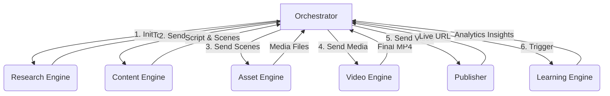

# System Architecture

## Architectural Pattern
The system follows a **Modular Monolith** architecture governed by a central **State Machine (Orchestrator)**. It is heavily data-driven and configuration-based. 

### Why not Microservices?
For a system intended to be self-hostable and easy to maintain by a solo operator or small team, a modular monolith in Python provides the clean boundaries of microservices without the operational overhead of managing multiple network deployments (Docker Swarm, Kubernetes, etc.). 

## Core Components (The "Engines")

1. **Orchestrator (`orchestrator/`)**
   - The central brain. It dictates *what* happens and *when*.
   - Maintains the execution state in the database (e.g., `Status = SCRIPT_GENERATING`).
   - Responsible for robust try/catch logic, retries, crash recovery, and notifying the operator if a fatal unrecoverable error occurs.

2. **Research Engine (`research_engine/`)**
   - **Inputs:** Trend sources, RSS feeds, configuration keywords.
   - **Responsibilities:** Scrape data, analyze sentiment, filter duplicates against the database, select a winning topic.
   - **Outputs:** A structured `TopicProposal` object.

3. **Content Engine (`content_engine/`)**
   - **Inputs:** `TopicProposal`.
   - **Responsibilities:** Draft a script, run AI critic to review it, refine script, plan visual scenes.
   - **Outputs:** A structured `VideoScript` and `ScenePlan`.

4. **Asset Engine (`asset_engine/`)**
   - **Inputs:** `ScenePlan`.
   - **Responsibilities:** Download relevant web images, fetch background music from the local YouTube audio library, generate TTS (Text-to-Speech) voiceovers.
   - **Outputs:** Local file paths to all raw media assets.

5. **Video Engine (`video_engine/`)**
   - **Inputs:** Raw media assets, `VideoScript`.
   - **Responsibilities:** Stitch assets together using FFmpeg, sync audio and visual transitions, generate `.srt` subtitles, render final `.mp4`.
   - **Outputs:** Path to the final rendered video.

6. **Publisher Engine (`publisher/`)**
   - **Inputs:** Final video, `TopicProposal`.
   - **Responsibilities:** Generate thumbnails, write SEO title/description/tags, determine upload time, upload via YouTube API.
   - **Outputs:** Live YouTube Video URL.

7. **Learning Engine (`learning_engine/`)**
   - **Inputs:** Published Video IDs, past 30 days.
   - **Responsibilities:** Fetch analytics, update internal weights/rules for what makes a "good" topic or script for the specific channel.
   - **Outputs:** Updated guidelines in the database for the Research and Content engines.

## Data Flow

## Provider Abstraction Layer
The system will implement abstract base classes (ABCs) for external dependencies:
- `BaseLLMProvider` -> Implemented by `OpenAIProvider`, `OllamaProvider`, etc.
- `BaseImageProvider` -> Implemented by `WebScraperProvider`, `StabilityProvider`.
- `BaseTTSProvider` -> Implemented by `ElevenLabsProvider`, `EdgeTTSProvider`.

This ensures that the business logic never imports `openai` directly.

## Error Recovery Strategy
- **Granular Checkpointing:** The Orchestrator saves state to the database after every significant step (e.g., `SCRIPT_DRAFTED`, `ASSETS_DOWNLOADED`, `VIDEO_RENDERED`).
- **Idempotency:** If the system restarts and the state is `VIDEO_RENDERED`, it will immediately hand off to the `Publisher` instead of re-rendering. 
- **Fatal Error Notification:** If an API completely changes or a code bug causes a crash, the Orchestrator's top-level try-catch will log the stack trace and optionally ping a webhook (e.g., Discord) to alert the user.
